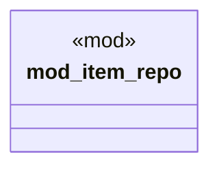

# `boilerplate/crates/sqlite/src/lib.rs`

Source SHA-256: `3216d221084397597410da6b1f3d518463f37a941194de310b5b355a0cc0831f`

## Dependencies

- `item_repo::SqliteItemRepository`
- `sqlx::SqlitePool`

## Standing

- Structural parse: `ALIVE`
- Runtime behavior: `UNKNOWN`
