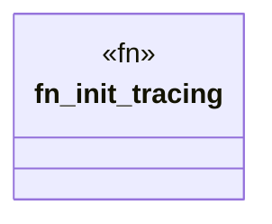

# `boilerplate/src/src/lib.rs`

Source SHA-256: `bb2dbd9ddccbadd53b797e370932f6ee329896b3fa5b0bc41a1bf979611bede2`

## Dependencies

- `tracing_subscriber::{fmt, EnvFilter}`

## Standing

- Structural parse: `ALIVE`
- Runtime behavior: `UNKNOWN`
