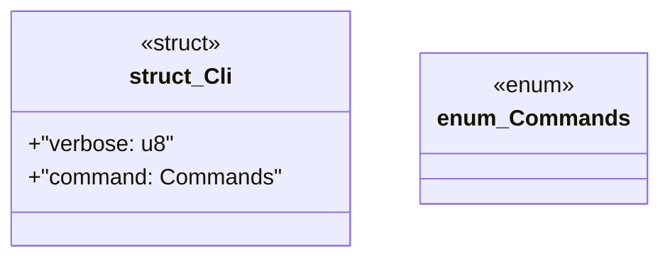

# `boilerplate/src/src/main.rs`

Source SHA-256: `8e62ef0e6cfd4c6510ed440a3f78be9f642f55393637c4f6a39b14a39608c5b4`

## Dependencies

- `anyhow::Result`
- `clap::{Parser, Subcommand}`

## Standing

- Structural parse: `ALIVE`
- Runtime behavior: `UNKNOWN`
