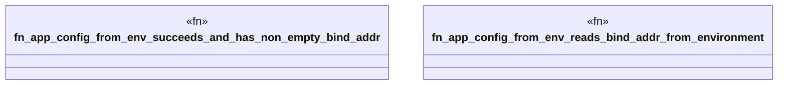

# `boilerplate/src/tests/config_integration.rs`

Source SHA-256: `a55fb8c621c57828d97027aacd95209559d94b7a5554595395efada45aee8086`

## Dependencies

- `bp_config::AppConfig`

## Standing

- Structural parse: `ALIVE`
- Runtime behavior: `UNKNOWN`
