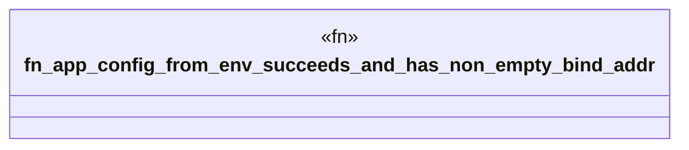

# `boilerplate/tests/integration/mod.rs`

Source SHA-256: `99ba2211cfaa811bf9bc70ff91c66723e9fb4962e52ecacf840ded5d89965b94`

## Dependencies

- `bp_config::AppConfig`

## Standing

- Structural parse: `ALIVE`
- Runtime behavior: `UNKNOWN`
