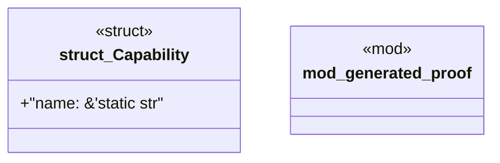

# `book/code/examples/canonical-level-five-consumer/src/generated_catalog.rs`

Source SHA-256: `3a92db2a3d3daefdda54507325845b58a843de0c6028acac4006846d68d2c464`

## Dependencies

- `super::*`

## Standing

- Structural parse: `ALIVE`
- Runtime behavior: `UNKNOWN`
