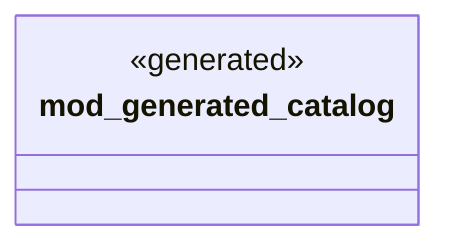

# `book/code/examples/canonical-level-five-consumer/src/ggen_pack_mods.rs`

Source SHA-256: `d8b69a7943d10c751ad1ec7b84f01fc04202eb3db7b1174dc98a9de252e8ada3`

## Dependencies

- None observed.

## Standing

- Structural parse: `ALIVE`
- Runtime behavior: `UNKNOWN`
