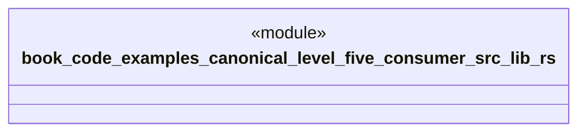

# `book/code/examples/canonical-level-five-consumer/src/lib.rs`

Source SHA-256: `9fab3556ce086878e0a56cb149eb2f049ea51edc6254e6bb615826601fc87650`

## Dependencies

- `generated_catalog::{Capability, CAPABILITIES}`

## Standing

- Structural parse: `ALIVE`
- Runtime behavior: `UNKNOWN`
