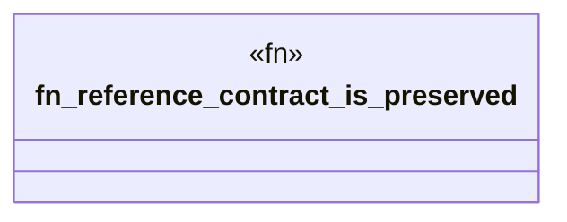

# `book/code/examples/canonical-level-five-consumer/tests/reference_conformance.rs`

Source SHA-256: `d2d7b9d03f13c7fcdb0b1549b2b3d7db9b8f47e1e1fc62cfcd11d1a71a5fe24d`

## Dependencies

- `canonical_level_five_consumer::{Capability, CAPABILITIES}`

## Standing

- Structural parse: `ALIVE`
- Runtime behavior: `UNKNOWN`
