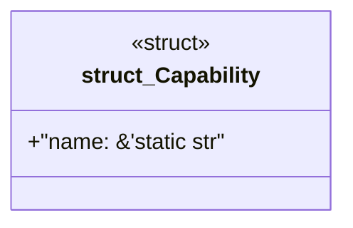

# `book/code/packs/canonical-level-five-pack/reference/src/generated_catalog.rs`

Source SHA-256: `19eb2cf3631588c96140f070fd48da564a0e4936500ff9d13f260e63599b3a99`

## Dependencies

- None observed.

## Standing

- Structural parse: `ALIVE`
- Runtime behavior: `UNKNOWN`
