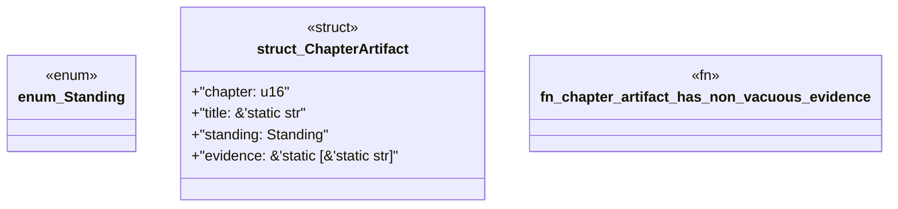

# `book/src/listings/001-1-from-code-generation-to-manufacturing.rs`

Source SHA-256: `64c161534ef133339ff65142c0de142789f93e9082f07b98937177f97fcdf626`

## Dependencies

- None observed.

## Standing

- Structural parse: `ALIVE`
- Runtime behavior: `UNKNOWN`
