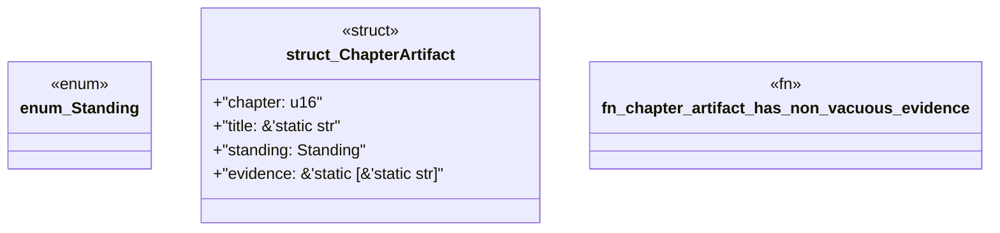

# `book/src/listings/002-2-the-artifact-equation.rs`

Source SHA-256: `c61d0231628d360431aa5955848e011eb25682ec9d4edbd07919d0c6fdf1f401`

## Dependencies

- None observed.

## Standing

- Structural parse: `ALIVE`
- Runtime behavior: `UNKNOWN`
