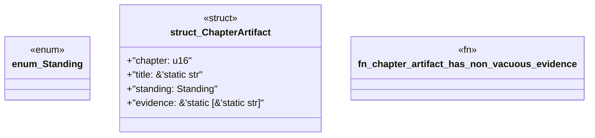

# `book/src/listings/009-9-the-five-stage-manufacturing-pipeline.rs`

Source SHA-256: `8ca36d57a95344c82a58a52b75735843c4c352d79a24fa582ee3eb8669c445cf`

## Dependencies

- None observed.

## Standing

- Structural parse: `ALIVE`
- Runtime behavior: `UNKNOWN`
