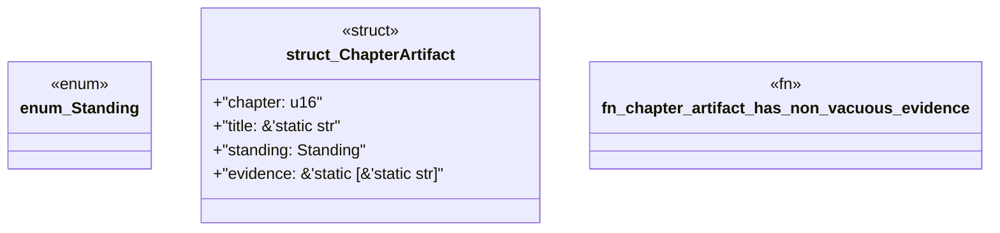

# `book/src/listings/010-10-load-extract-render-verify-emit.rs`

Source SHA-256: `652f1c31dfc58e337b3173176e71a33b2bf2d6fa235a5a36bb03b02271877db8`

## Dependencies

- None observed.

## Standing

- Structural parse: `ALIVE`
- Runtime behavior: `UNKNOWN`
