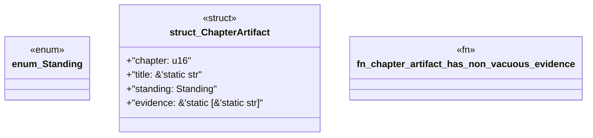

# `book/src/listings/012-12-why-generated-files-are-not-authority.rs`

Source SHA-256: `f62d9dfc37191c6bfb987cb757176e18e88a7c78fbcf2b9d6096b0c9b0e56b60`

## Dependencies

- None observed.

## Standing

- Structural parse: `ALIVE`
- Runtime behavior: `UNKNOWN`
