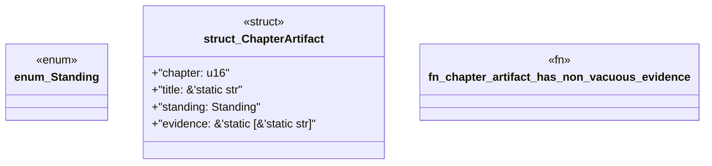

# `book/src/listings/013-13-packs-as-routable-capability-cells.rs`

Source SHA-256: `998083c7f65379926689707222555851669d52a41a8a12cda12fbe28edffd5da`

## Dependencies

- None observed.

## Standing

- Structural parse: `ALIVE`
- Runtime behavior: `UNKNOWN`
