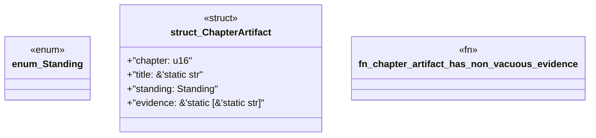

# `book/src/listings/014-14-pack-boundaries.rs`

Source SHA-256: `73463e7ae9226b7500b9505a0dfeeaa350322a8358c7e9509185e97b29762410`

## Dependencies

- None observed.

## Standing

- Structural parse: `ALIVE`
- Runtime behavior: `UNKNOWN`
