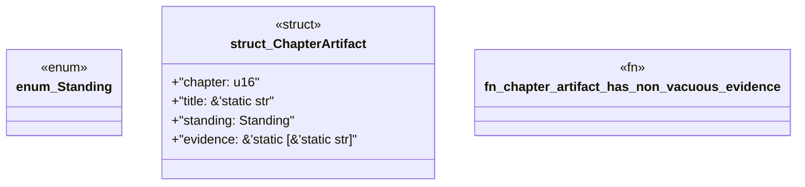

# `book/src/listings/015-15-pack-identity.rs`

Source SHA-256: `7e4056bc04aa7993a7677d84ab4146d57b7552e6f2919621b67ff925517dd21c`

## Dependencies

- None observed.

## Standing

- Structural parse: `ALIVE`
- Runtime behavior: `UNKNOWN`
