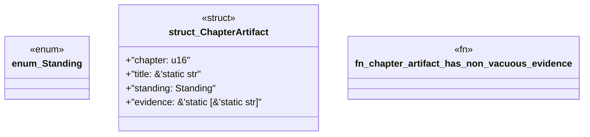

# `book/src/listings/016-16-pack-inputs-and-outputs.rs`

Source SHA-256: `0427ba33ba37b797171c3a914fb9751b94db882ad6e0ef94cc440d07a49b0dad`

## Dependencies

- None observed.

## Standing

- Structural parse: `ALIVE`
- Runtime behavior: `UNKNOWN`
