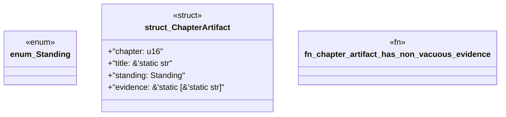

# `book/src/listings/021-21-pack-fixtures.rs`

Source SHA-256: `18a8b89f11ee3453e7c7f6bebf8263c4adce8b03cd9288564abf504a98fbb5c7`

## Dependencies

- None observed.

## Standing

- Structural parse: `ALIVE`
- Runtime behavior: `UNKNOWN`
