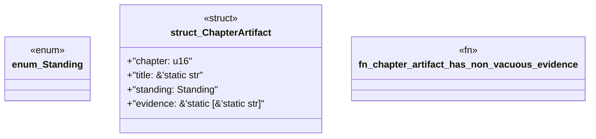

# `book/src/listings/022-22-pack-hooks.rs`

Source SHA-256: `1e3847f13d3f117a641d2f7c3b142496d20d660bb73a40d8516ad30d410ead7b`

## Dependencies

- None observed.

## Standing

- Structural parse: `ALIVE`
- Runtime behavior: `UNKNOWN`
