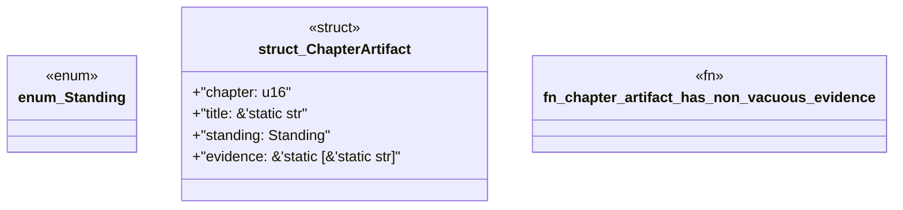

# `book/src/listings/023-23-pack-reference-oracles.rs`

Source SHA-256: `c7f764fbd2ca005f4495df29fe5da494cf38a81447ffb56529a570fa3bd11285`

## Dependencies

- None observed.

## Standing

- Structural parse: `ALIVE`
- Runtime behavior: `UNKNOWN`
