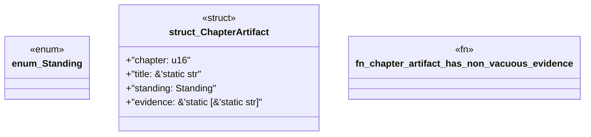

# `book/src/listings/026-26-type-one-codegen-packs.rs`

Source SHA-256: `5f555fd649a06539344b57cd8c579d0c43d0fda80ea815e5947ba8a562ef8fce`

## Dependencies

- None observed.

## Standing

- Structural parse: `ALIVE`
- Runtime behavior: `UNKNOWN`
