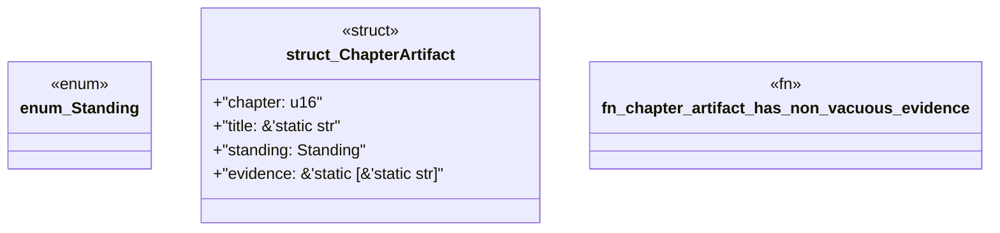

# `book/src/listings/027-27-type-two-knowledge-hook-packs.rs`

Source SHA-256: `41f3231c109f92deff3e9ecc762926184395247bf42acdee31ea1acefaee283d`

## Dependencies

- None observed.

## Standing

- Structural parse: `ALIVE`
- Runtime behavior: `UNKNOWN`
