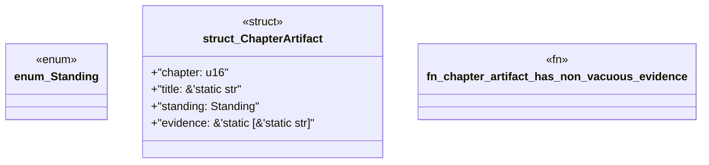

# `book/src/listings/028-28-type-three-case-study-corpus-packs.rs`

Source SHA-256: `28f37f3236ac48327eb2e8fe645c354eab3214296260be73f939b140de5d4b16`

## Dependencies

- None observed.

## Standing

- Structural parse: `ALIVE`
- Runtime behavior: `UNKNOWN`
