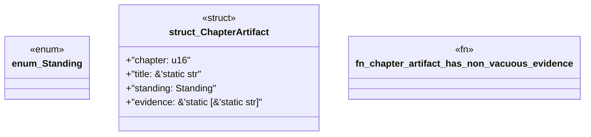

# `book/src/listings/030-30-choosing-a-consumption-path.rs`

Source SHA-256: `b3a854875b43c2c97b1a5f939e8389c6d0484d5012e1155f13bba9cb658d066f`

## Dependencies

- None observed.

## Standing

- Structural parse: `ALIVE`
- Runtime behavior: `UNKNOWN`
