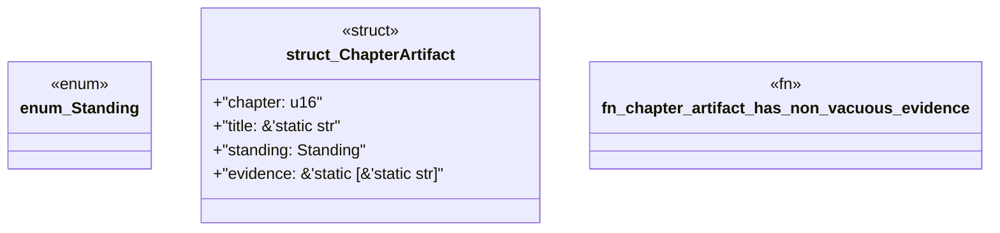

# `book/src/listings/031-31-mixed-packs.rs`

Source SHA-256: `e6605ab6c1086f30844ba416ad9707e58826eac09166e5a2d3804480ff656475`

## Dependencies

- None observed.

## Standing

- Structural parse: `ALIVE`
- Runtime behavior: `UNKNOWN`
