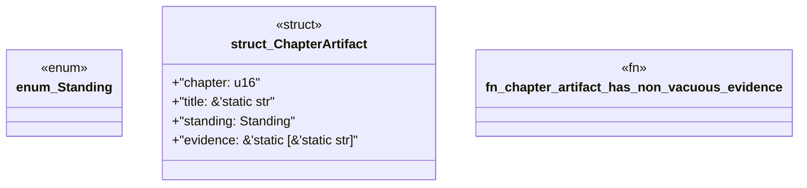

# `book/src/listings/032-32-separating-product-and-release-packs.rs`

Source SHA-256: `e545f88dab7aff000b027c52c5b94f8f6012006d0bf43e8b2efb31a82217df08`

## Dependencies

- None observed.

## Standing

- Structural parse: `ALIVE`
- Runtime behavior: `UNKNOWN`
