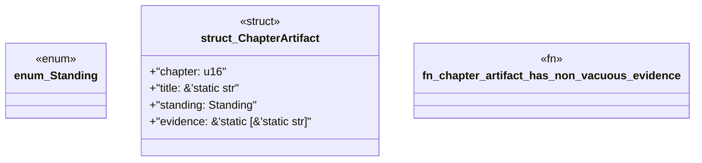

# `book/src/listings/033-33-when-a-catalog-is-enough.rs`

Source SHA-256: `333bd24501199520b5f10d9a9a35466b5007bb12ffc135c807f8fc8bfcbf0d5b`

## Dependencies

- None observed.

## Standing

- Structural parse: `ALIVE`
- Runtime behavior: `UNKNOWN`
