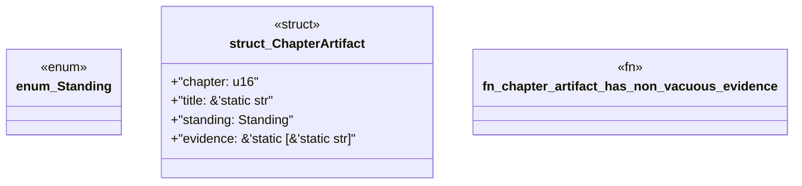

# `book/src/listings/035-35-when-the-pack-must-generate-proof.rs`

Source SHA-256: `4d52352564f005e908911ed4ac304649ef4e52c3546164201371e18700376206`

## Dependencies

- None observed.

## Standing

- Structural parse: `ALIVE`
- Runtime behavior: `UNKNOWN`
