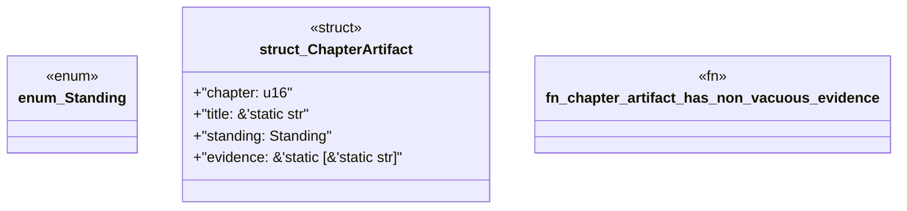

# `book/src/listings/036-36-when-the-pack-must-generate-a-whole-product.rs`

Source SHA-256: `4021a7467494dc3713f6cd4edf2fc9792ae4a8e54458d55323ea8a6d3844a0b0`

## Dependencies

- None observed.

## Standing

- Structural parse: `ALIVE`
- Runtime behavior: `UNKNOWN`
