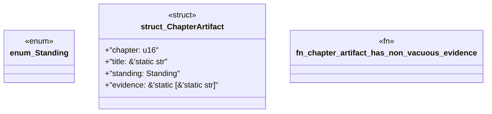

# `book/src/listings/037-37-l0-inert.rs`

Source SHA-256: `c6de91798fd91e1f22a7934641eee4fb172898cf0bc84fca9986ffd10a8cd6d9`

## Dependencies

- None observed.

## Standing

- Structural parse: `ALIVE`
- Runtime behavior: `UNKNOWN`
