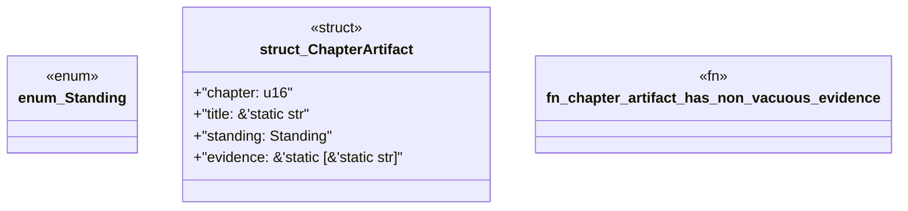

# `book/src/listings/038-38-l1-syntactically-valid.rs`

Source SHA-256: `bb9c3a40acd3cb48081eb490694c641f91a43da33f2c53b97473fae02c132ea6`

## Dependencies

- None observed.

## Standing

- Structural parse: `ALIVE`
- Runtime behavior: `UNKNOWN`
