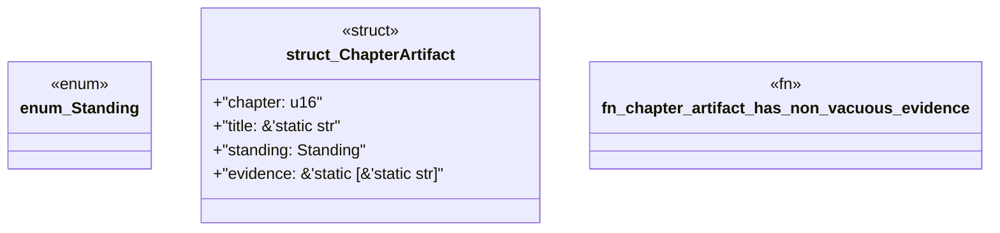

# `book/src/listings/039-39-l2-consumed.rs`

Source SHA-256: `cacadd3b456b159dcca2f3214e64f48e505cee697e46d9d116326e6403f44a23`

## Dependencies

- None observed.

## Standing

- Structural parse: `ALIVE`
- Runtime behavior: `UNKNOWN`
