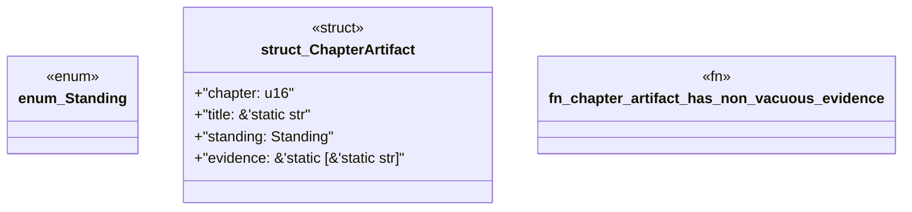

# `book/src/listings/040-40-l3-verified.rs`

Source SHA-256: `6963ddecb0a238c850b62a150a15a7e9d3bde03d02b9e4ba3c7f481b13288b97`

## Dependencies

- None observed.

## Standing

- Structural parse: `ALIVE`
- Runtime behavior: `UNKNOWN`
