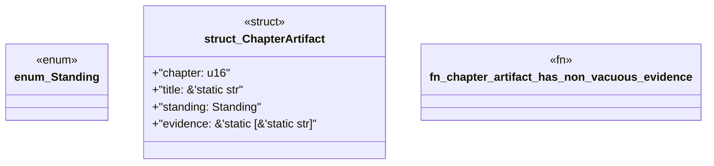

# `book/src/listings/041-41-l4-hardened.rs`

Source SHA-256: `2ff2c44d418ca514228a1cb0a410ea1f87714bbe41ae936288381caff4b22a32`

## Dependencies

- None observed.

## Standing

- Structural parse: `ALIVE`
- Runtime behavior: `UNKNOWN`
