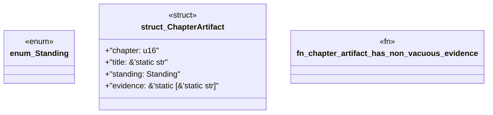

# `book/src/listings/042-42-l5-complete-substitute.rs`

Source SHA-256: `fd0cadafe6d92fea0f326800d4da2caa60c5702aa4b47a1a844acafde870897e`

## Dependencies

- None observed.

## Standing

- Structural parse: `ALIVE`
- Runtime behavior: `UNKNOWN`
