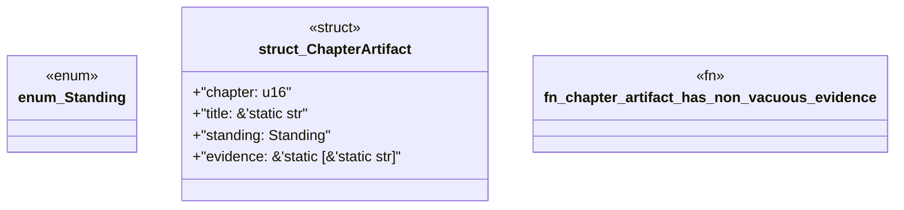

# `book/src/listings/043-43-generation-depth.rs`

Source SHA-256: `ff0a42f4419e55fd7dffeb00a61b813354284b9995c903cf3b2df9cd48a659df`

## Dependencies

- None observed.

## Standing

- Structural parse: `ALIVE`
- Runtime behavior: `UNKNOWN`
