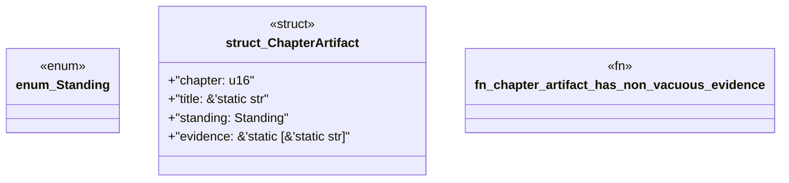

# `book/src/listings/044-44-handler-gap-size.rs`

Source SHA-256: `c47a555ae8902216e4080ef41d0f8cc1b234ddb9eba4ed4dd62e37cbdddd56d7`

## Dependencies

- None observed.

## Standing

- Structural parse: `ALIVE`
- Runtime behavior: `UNKNOWN`
