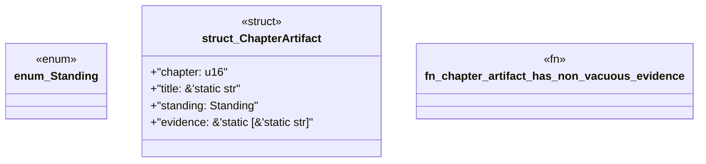

# `book/src/listings/046-46-consumer-effort.rs`

Source SHA-256: `4be0ec59aa803c0f03364236b76dae994de36125f4447e57d1bb39602b1b0401`

## Dependencies

- None observed.

## Standing

- Structural parse: `ALIVE`
- Runtime behavior: `UNKNOWN`
