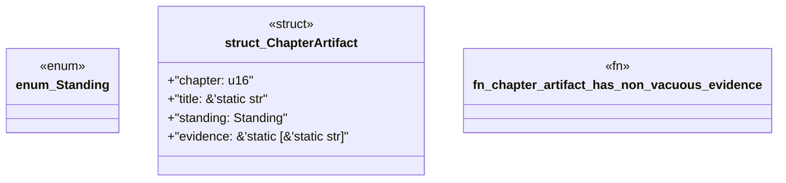

# `book/src/listings/047-47-test-generation.rs`

Source SHA-256: `c3bad2621e8d4cd583757fa7de7d18e1c1765d8ad64a550039fdcc5494d06865`

## Dependencies

- None observed.

## Standing

- Structural parse: `ALIVE`
- Runtime behavior: `UNKNOWN`
