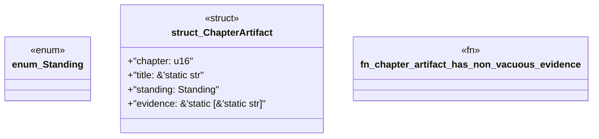

# `book/src/listings/048-48-regeneration-lifecycle.rs`

Source SHA-256: `fd9c24a263b7a6c211c6812dee6bd51e9ae08666004e87937665791cf3af1f39`

## Dependencies

- None observed.

## Standing

- Structural parse: `ALIVE`
- Runtime behavior: `UNKNOWN`
