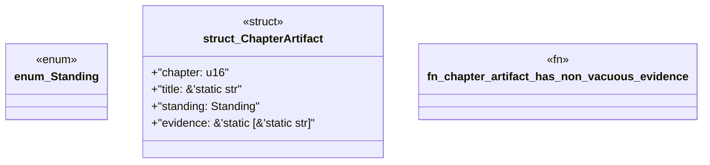

# `book/src/listings/049-49-target-api-fidelity.rs`

Source SHA-256: `55b8cbd287a3fd0d012c5b253951b61676dc0b72a578daba0d6f9de1f054681d`

## Dependencies

- None observed.

## Standing

- Structural parse: `ALIVE`
- Runtime behavior: `UNKNOWN`
