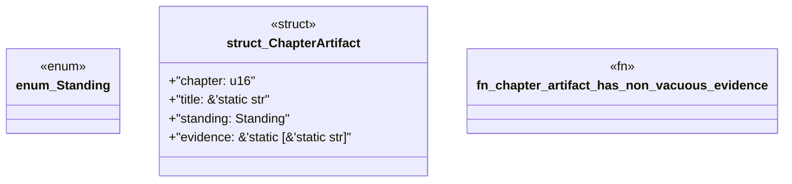

# `book/src/listings/050-50-evidence-per-maturity-cell.rs`

Source SHA-256: `4005693d84a388ee859642c553ff969f7019d3316430f8cdb1031c45a65b54f6`

## Dependencies

- None observed.

## Standing

- Structural parse: `ALIVE`
- Runtime behavior: `UNKNOWN`
