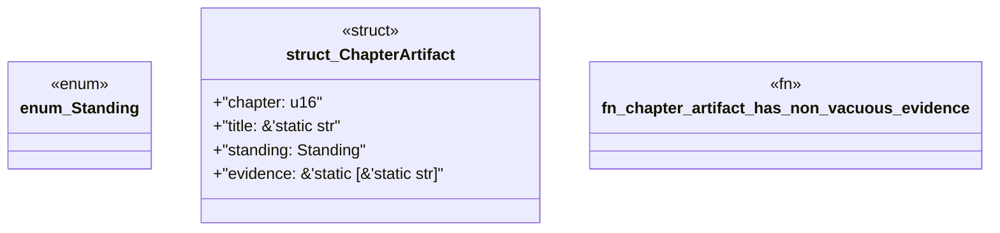

# `book/src/listings/052-52-the-level-five-calibration-rule.rs`

Source SHA-256: `464d9884d3399441be82a19cbfd341b90225108edd28bbd1efb245249173c344`

## Dependencies

- None observed.

## Standing

- Structural parse: `ALIVE`
- Runtime behavior: `UNKNOWN`
