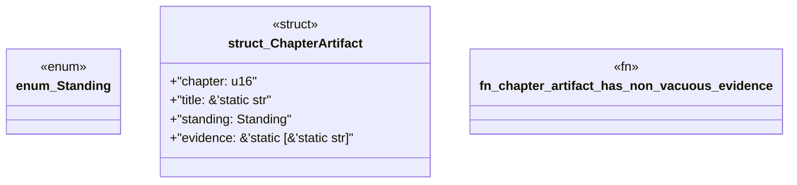

# `book/src/listings/053-53-the-reference-is-the-customer.rs`

Source SHA-256: `c3a387a8a01bd5e40963dbcc0af892b99beb0ed1dc075e16edd7b10b78d35469`

## Dependencies

- None observed.

## Standing

- Structural parse: `ALIVE`
- Runtime behavior: `UNKNOWN`
