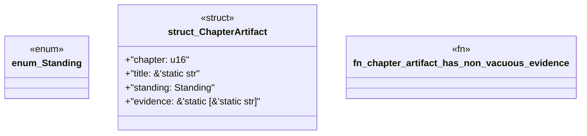

# `book/src/listings/054-54-independent-means-independent.rs`

Source SHA-256: `34bda074f5b43eb4fd6bde62279a8118c147c9a6a9d287a677c47e58910a3a83`

## Dependencies

- None observed.

## Standing

- Structural parse: `ALIVE`
- Runtime behavior: `UNKNOWN`
