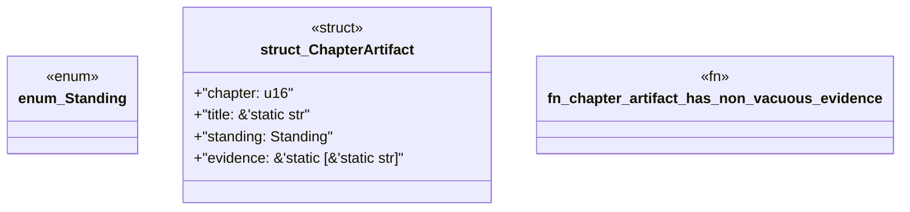

# `book/src/listings/055-55-reference-source-trees.rs`

Source SHA-256: `b3d85413b701da454f3e79e35349c997e62177bc021bcf818ceba2dbe6ca7399`

## Dependencies

- None observed.

## Standing

- Structural parse: `ALIVE`
- Runtime behavior: `UNKNOWN`
