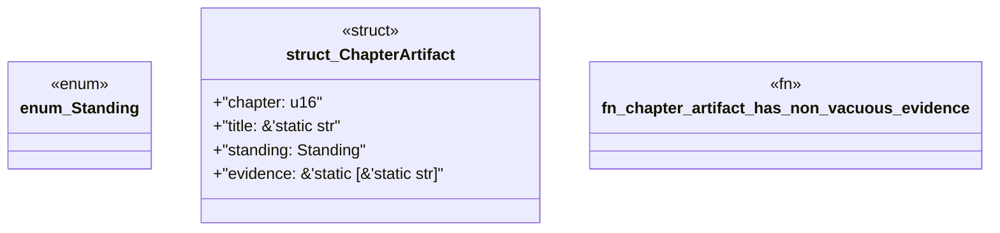

# `book/src/listings/056-56-reference-public-apis.rs`

Source SHA-256: `432dc59b343067e42604edf16926c695c68a3879d834a0fbef878691b5f2e538`

## Dependencies

- None observed.

## Standing

- Structural parse: `ALIVE`
- Runtime behavior: `UNKNOWN`
