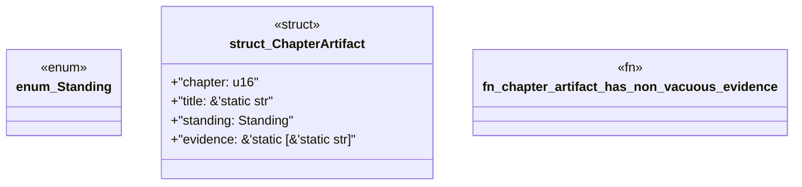

# `book/src/listings/057-57-reference-behavior.rs`

Source SHA-256: `9fe27c217160f1e7aa007fb926cde960036e9edcb971a8eae9d6a128a5c8357b`

## Dependencies

- None observed.

## Standing

- Structural parse: `ALIVE`
- Runtime behavior: `UNKNOWN`
